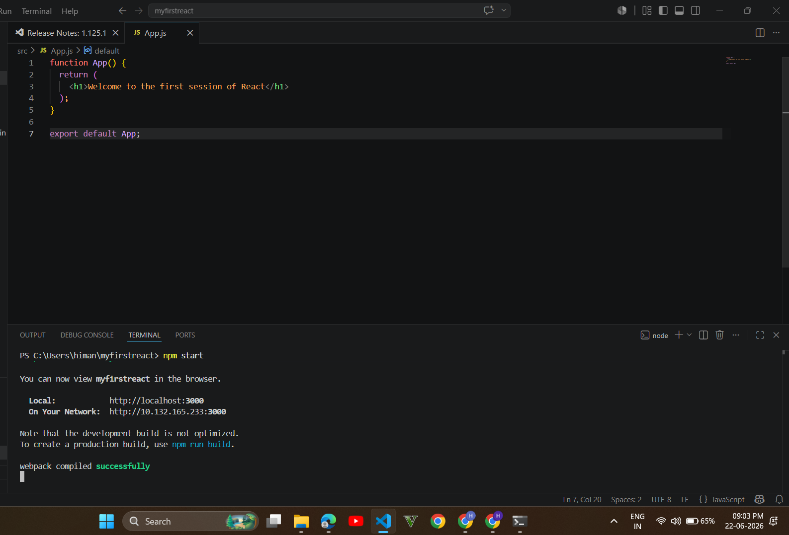
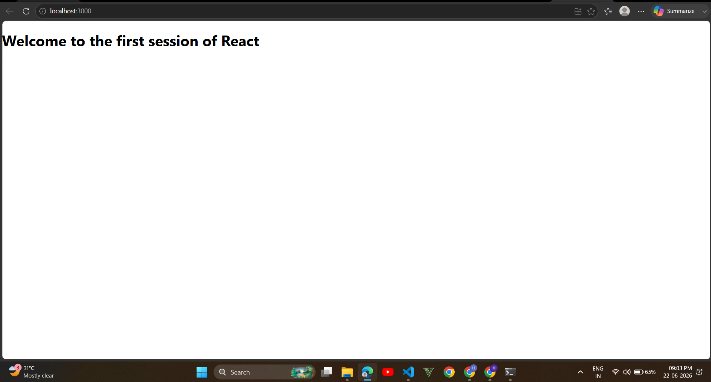

# ReactJS Hands-On Lab 1 (HOL 1)

## Candidate Details

- **Name:** Himanshu Yadav
- **College:** VIT Bhopal University
- **Program:** B.Tech Computer Science and Engineering (Cyber Security & Digital Forensics)
- **Week:** 1
- **Assessment:** ReactJS Hands-On Lab 1 (HOL 1)

---

## Task Description

The objective of this hands-on lab was to create a React application named **myfirstreact** and display the following heading on the webpage:

```text
Welcome to the first session of React
```

The task involved:

- Setting up the React development environment
- Creating a React application using Create React App
- Understanding the basic structure of a React project
- Modifying the `App.js` component
- Running the application locally using Node.js and npm

---

## Technologies Used

- ReactJS
- JavaScript
- Node.js
- npm
- Visual Studio Code

---

## Application Output

### Output Screenshot 1



### Output Screenshot 2



---

## Expected Output

```text
Welcome to the first session of React
```

---

## Learning Outcomes

Through this exercise, I gained practical experience in:

- Creating and configuring React applications
- Understanding React component structure
- Running React applications locally
- Working with npm packages and project dependencies
- Managing project files using Git and GitHub

---

## Status

✅ Task Successfully Completed
